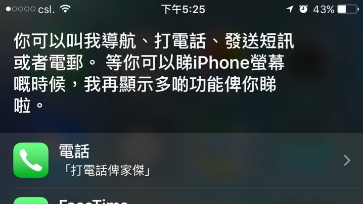
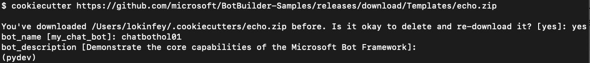
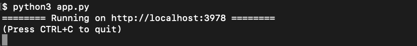
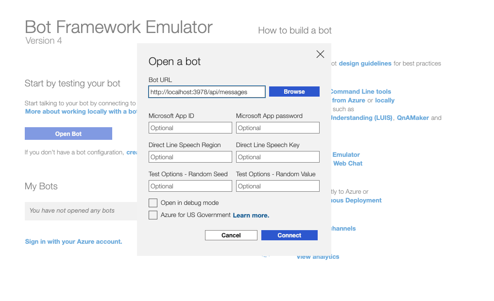
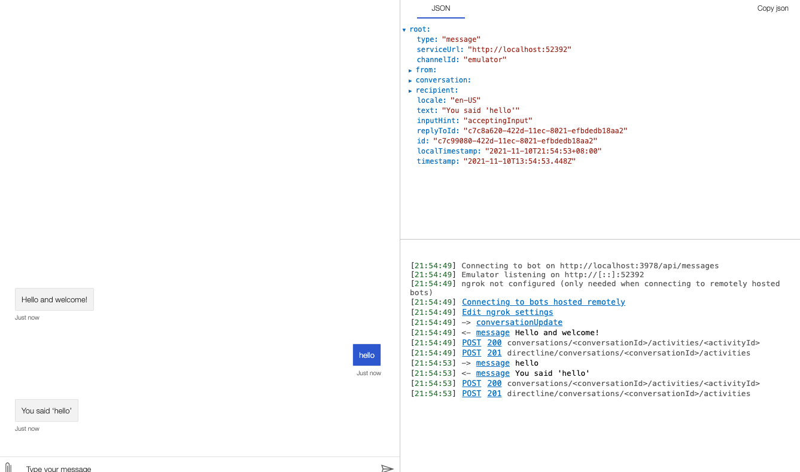

# **01. Chatbot是甚麼**

```txt
聊天機器人（ChatBot）是經由對話或文字進行交談的電腦程式。 能夠模擬人類對話，通過圖靈測試。 聊天機器人可用於實用的目的，如客戶服務或資訊獲取。目前，聊天機器人是虛擬助理（如Google智能助理）的一部分，可以與許多組織的應用程式，網站以及即時消息平台(Facebook Messenger)連接。
```

## **Chatbot 無處不在**

我地可以查天氣，叫車，問知識，仲有查訂單

<br/>


### **Microsoft Bot Framework 介紹**

Microsoft Bot Framework 也提供可在單一位置建立、測試、部署及管理智慧型 bot 的工具。 Bot Framework 包含模組化且可擴充的 SDK，可用於建立 bot，以及工具、範本和相關的 AI 服務。 使用此架構時，開發人員可以建立使用語音的 bot、瞭解自然語言、處理問題和解答等等。

### **動手創建自己的第一個chatbot**

<br/>

01. 準備工作，請參考00.Ready.pdf

02. 在Terminal下，安裝以下Python庫

```bash
pip3 install botbuilder-core
pip3 install asyncio
pip3 install aiohttp
pip3 install cookiecutter==1.7.0
```

03. 繼續在Terminal 下在指定位置創建你的chatbot應用，你可以參照手冊在Desktop桌面創建一個chatbot目錄

```bash

mkdir chatbot

cd chatbot

cookiecutter https://github.com/microsoft/BotBuilder-Samples/releases/download/Templates/echo.zip

```

創建過程中，你需要如圖輸入chatbot的名稱，和相關的描述說明（名稱是必須的，但描述可以忽略）, 如圖所示，建立了一個名為chatbothol01的bot檔案項目


<br/>
<br/>

04. 進入該目錄，並安裝對應的依賴庫

```bash

cd chatbothol01

pip3 install -r requirements.txt 


```


05. 啟動bot

```bash

python3 app.py

```

<br/>啟動成功狀態如下圖
<br/>
<br/>
<br/>

06. 打開Bot Framework Emulator , 點擊Open Bot Button，在Open Bot窗體內的Bot URL 輸入 http://localhost:3978/api/messages 


<br/>
<br/>


7.  點擊Connect Button 就可以進入Chatbot，，如果輸入hello，如果能如下圖所示，你的第一個chatbot就搭建成功了


<br/>
<br/>


