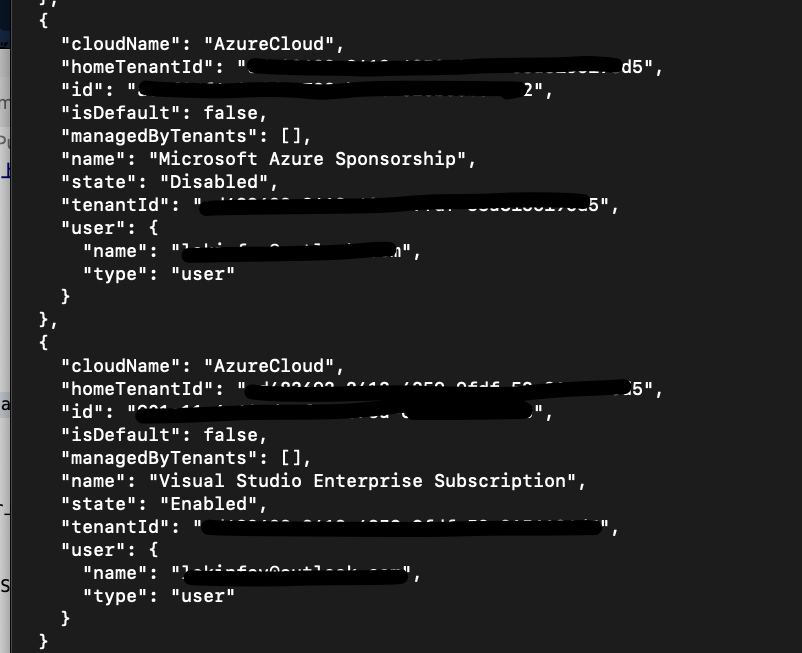
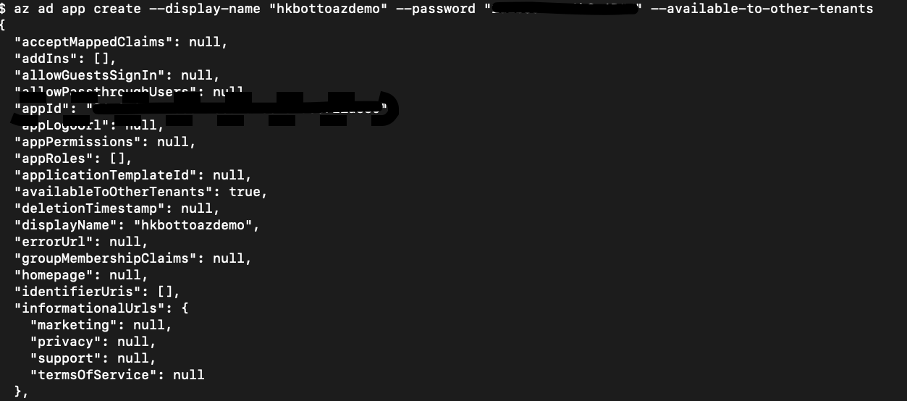
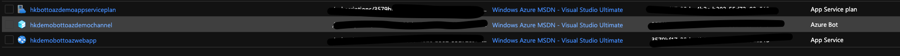
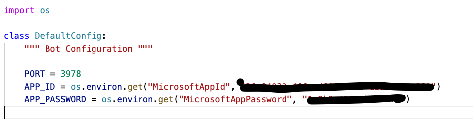
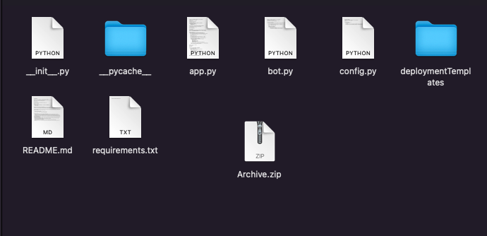
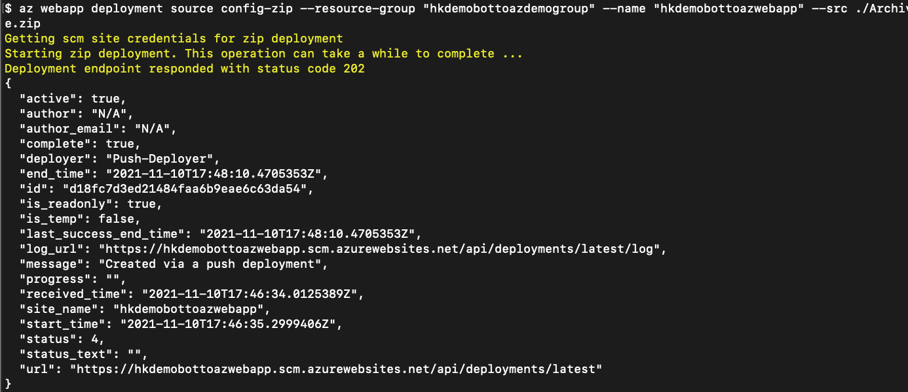
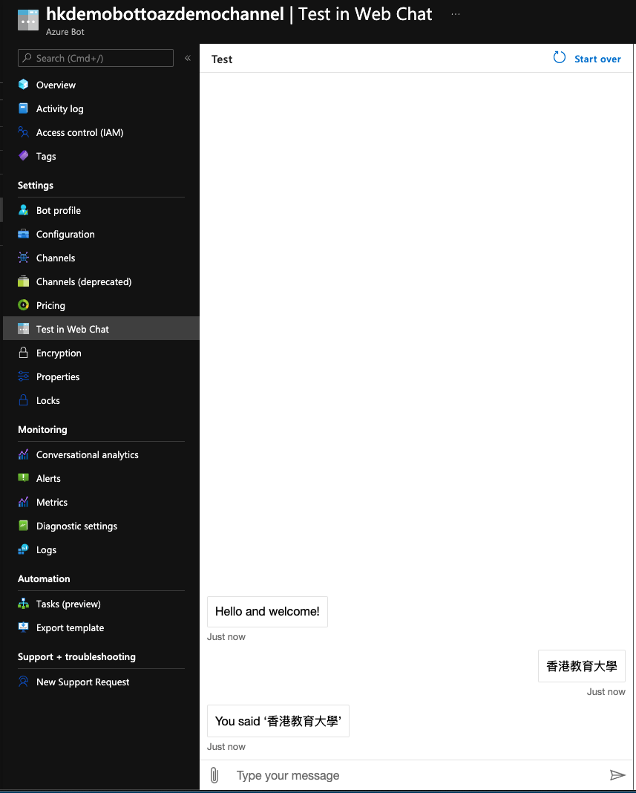

# **02. Publish你的Chatbot到Azure上**

01. 準備工作，請參考00.Ready.pdf

02. 在Terminal上執行以下命令


```bash

az login

```

登陸會跳轉到Browser，你需要在Browser上確認信息，成功後，Termianl會返回相關的你所有的Azure SubScription信息


03. 在Terminal 下選擇你的Azure SubScription


```bash

az account set --subscription ‘name or id’

```


執行成功，你可以看到如下圖信息


<br/>

1.  在Terminal上，創建一個Azure 上的雲端資源,注册应用程式

```bash

az ad app create --display-name "你的app名字" --password "記得是至少16位的密碼" --available-to-other-tenants

```
<br/>
<br/>

從返回結果你可以獲取你的appid ，并记录低设置的password 作为appPassword


03. 打開你的Azure Portal ，在App registration上你可以找到你通過步驟三創建的app名字，例如我剛才創建了chatbottoazure


<br/>
<br/>

04. 打開code目錄下的chatbothol2,並進入目錄在Terminal輸入以下命令


```bash

cd chatbothol2

az deployment sub create --template-file "./deploymentTemplates/template-with-new-rg.json" --location <所在區域，香港在eastasia> --parameters appId="剛才第二步拿到的appID" appSecret="剛才第二步拿到的appPassword" botId="新建的bot名" botSku=F0 newAppServicePlanName="App Service服務名" newWebAppName="bot服務名" groupName="新的資源組名" groupLocation="資源組所在區域，香港在eastasia" newAppServicePlanLocation="資源組所在區域，香港在eastasia" --name "bot服務名"

```

以下是我的案例，大家可以參考


```bash

az deployment sub create --template-file "./deploymentTemplates/template-with-new-rg.json" --location eastasia --parameters appId="剛才第二步拿到的appID" appSecret="剛才第二步拿到的appPassword" botId="hkdemobottoazdemochannel" botSku=F0 newAppServicePlanName="hkdemobottoazwebappplan" newWebAppName="hkdemobottoazwebapp" groupName="hkdemobottoazdemogroup" groupLocation="eastasia" newAppServicePlanLocation="eastasia" --name "hkdemobottoazdemochannel"

```

创建成功后你可以在Azure Portal上All resources看到如下信息

<br/>
<br/>

05. 在config.py文件中配置在第二步中獲取的AppID，AppPassword


<br/>
<br/>

06. zip 文件

這裡zip應用是有技巧的，大家一定要注意，要zip的是app.py所處目錄下zip，否則部署的時候會失敗 (如下圖，我在chatbothol2下zip，生成了一個Archive.zip)


<br/>
<br/>

07. 上傳zip文件到剛才生成的webapp服務，執行以下操作

```bash

az webapp deployment source config-zip --resource-group "之前創建的資源組名" --name "之前創建的webapp名" --src zip文件路徑

```

以下是我的案例，大家可以參考


<br/>
<br/>


08. 創建成功後，可以去Azure Portal 查看Bot service(注意：上傳成功，要等等)，選擇Test in WebChat，如果正確效果如下


<br/>
<br/>


