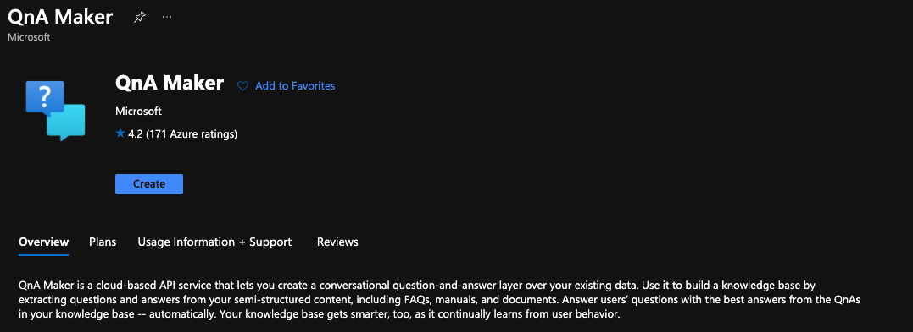
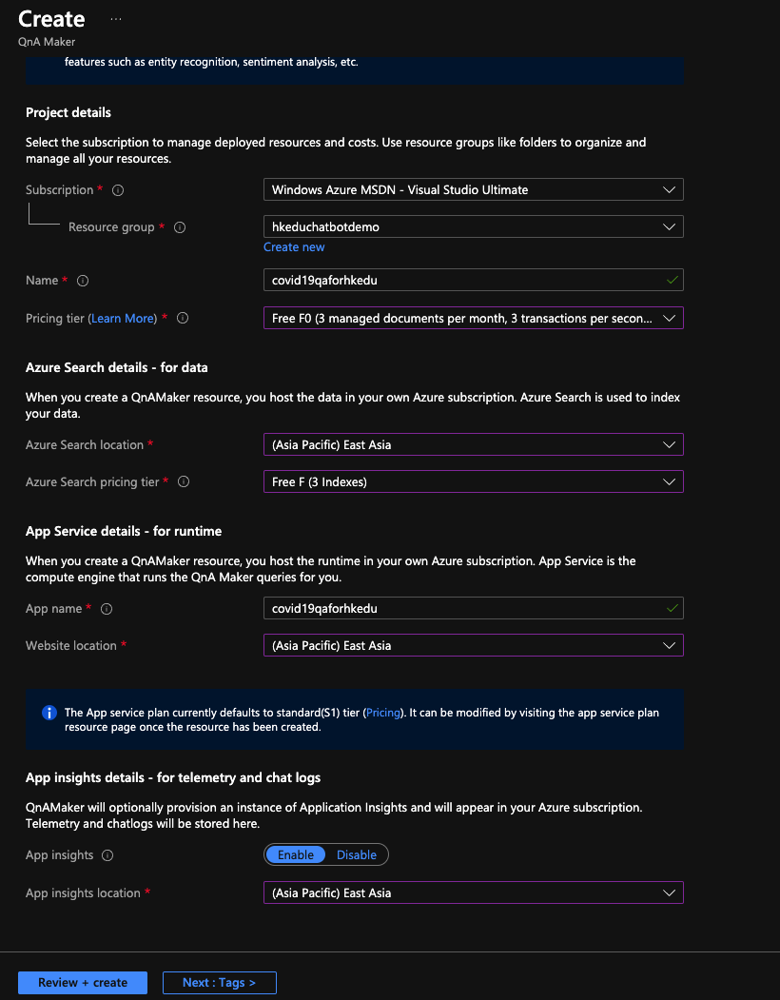
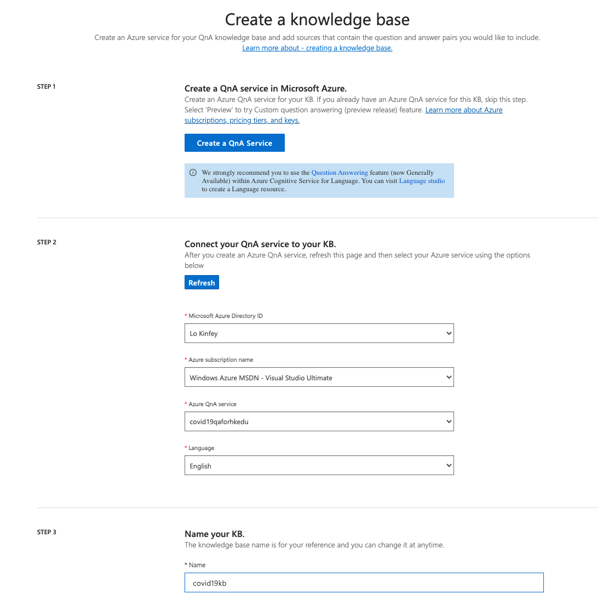
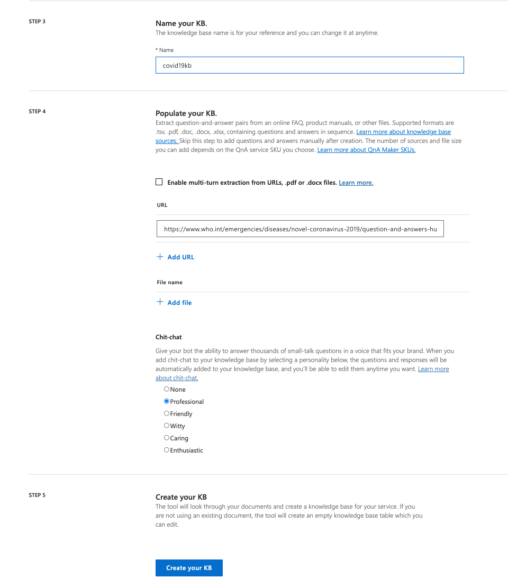
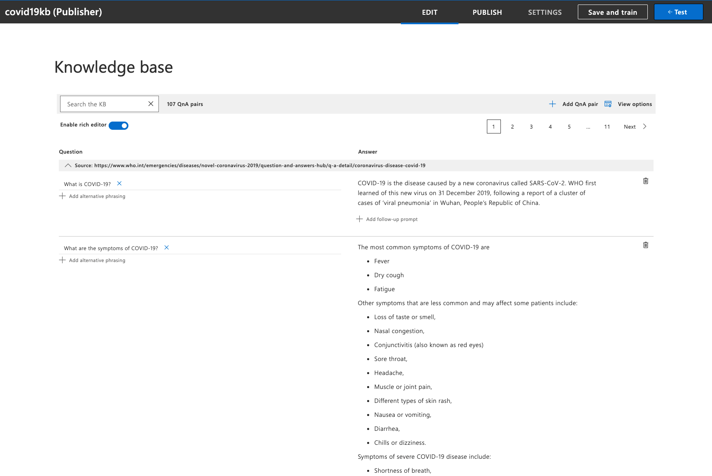
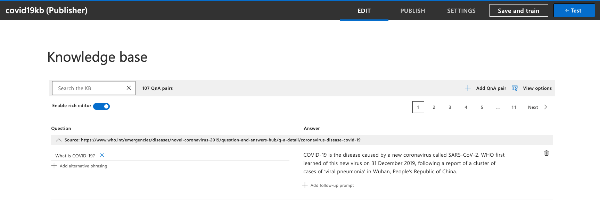
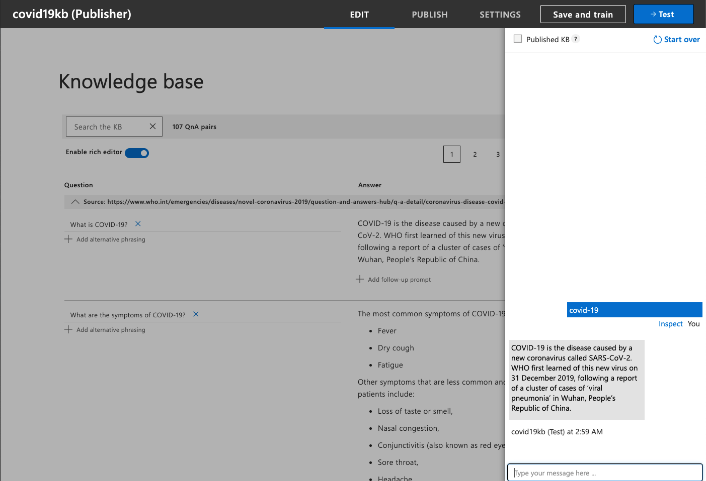
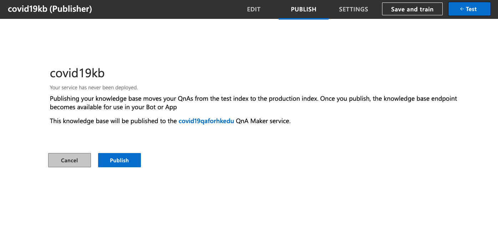
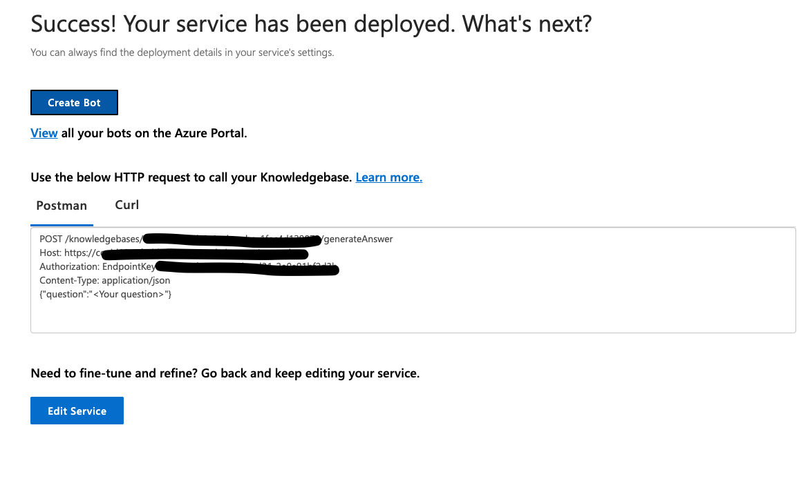

# **03. QnA Maker**

## **甚麼是 QnA Maker ?**

QnA Maker 是一項雲端式自然語言處理 (NLP) 服務，可讓您透過您的資料建立自然對話層。 其用來從資訊的自訂知識庫 (KB) 為任何輸入尋找最適當的答案。QnA Maker 通常用來建立交談式用戶端應用程式，其中包括社交媒體應用程式、聊天機器人，以及具備語音功能的傳統型應用程式。QnA Maker 不會儲存客戶資料。 所有客戶資料 (問題的答案和聊天記錄) 都會儲存在客戶部署相依服務實例的區域中。

## **QnA Maker 的使用時機**

當您有靜態資訊時 - 當回答知識庫中有靜態資訊時，請使用 QnA Maker。 此知識庫是依據需求所自訂的，且您已使用 PDF 和 URL 等文件建置好。

當您想要為要求、問題或命令提供相同的答案時 - 當不同使用者提交相同問題時，系統會傳回相同的答案。

當您想要根據中繼資訊來篩選靜態資訊時 - 新增 中繼資料標籤，以提供與用戶端應用程式使用者和資訊相關的其他篩選選項。 常見的中繼資料資訊包括閒聊、內容類型或格式、內容用途和內容有效期限。

當您想要管理包含靜態資訊的聊天機器人對話時 - 您的知識庫會取得使用者的交談文字或命令，並做出回答。 如果答案是預先決定對話流程的一部分 (在您的知識庫中會以多回合內容來表示)，則聊天機器人可以輕鬆地提供此流程。

## **創建QnA Maker**
 
01. 進入Azure Portal去資源組創建QnA Maker

 
  

如上圖點擊Create

 
 
 

02. 進入QnA Maker（<a href="https://www.qnamaker.ai/">https://www.qnamaker.ai/</a>）頁面，綁定剛才創建的相關服務，你就可以為自己添加自己項目中的預料庫了. 按照順序選擇你的Azure訂閱，剛才創建的QnA Service名，你的QnA語言, 知識庫名，你知識庫的來源，最後是資料庫的相關信息

如我們這裡採用英語的語料庫，以世衛Covid-19的數據作為那本，並作為專業語料庫，命名為covid19kb

注： Covid-19 世衛語料庫地址 https://www.who.int/emergencies/diseases/novel-coronavirus-2019/question-and-answers-hub/q-a-detail/coronavirus-disease-covid-19

 
 
 

完成資料填充後你就可以生成關於Covid-19的知識庫了

 
 

03. 你可以在QnA Maker上進行訓練

選擇covid19kb知識庫的右上角的Save and Train 按鈕進行保存和訓練

 
 

04. 你可以在QnA Maker上進行測試

選擇covid19kb知識庫的右上角的Test按鈕進行測試

 
 

04. 測試滿意後你就可以點擊發布按鈕進行發布

 
 

發布後會告訴你相關的信息，如endpointkey ，url等

 
 

05. 運行code下的chatbothol03的notebook看看結果

