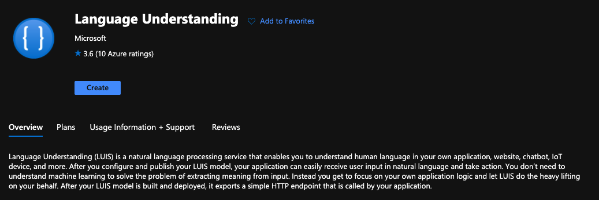
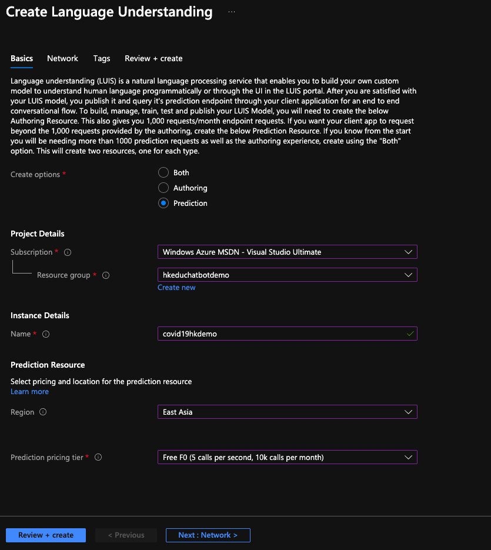
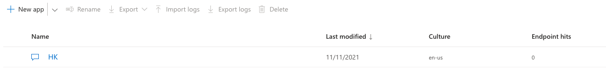
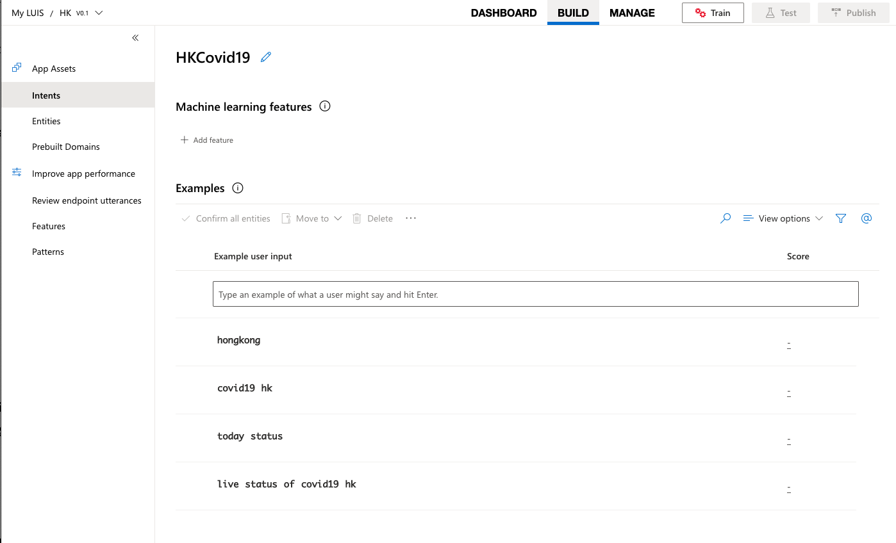
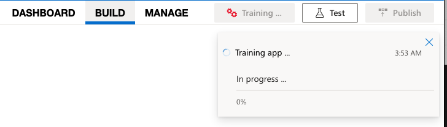
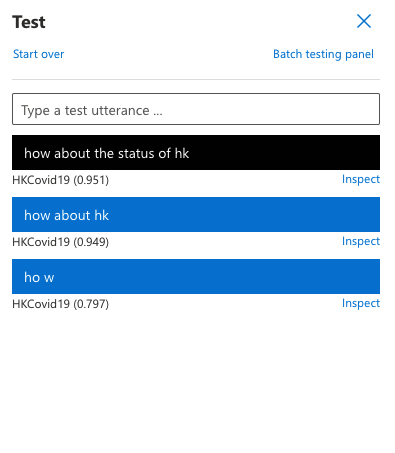
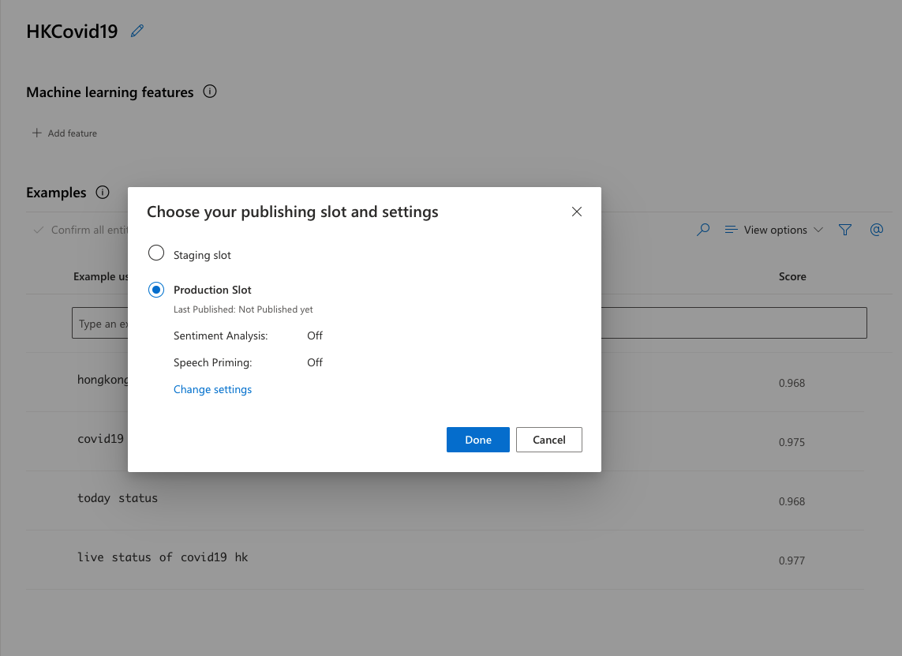
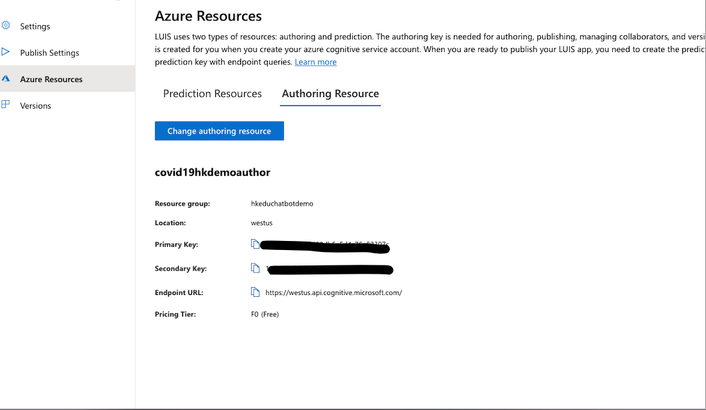

# **04. LUIS是甚麼**

```bash

Language Understanding (LUIS) 是一種雲端式交談式 AI 服務，可將自訂機器學習智慧套用至使用者的對話、自然語言文字中，以預測整體意義，並找出相關的詳細資訊。 LUIS 可讓您透過其 自訂入口網站、 api 和 SDK 用戶端程式庫進行存取。

```

## **LUIS 供應專案**

簡易性： LUIS 可從內部 AI 專業知識或任何先前的機器學習知識，卸載您的需求。 只要按幾下滑鼠，您就可以建立自己的交談 AI 應用程式。 您可以遵循其中一個 快速入門來建立自訂應用程式，也可以使用其中一個預先建立的 網域 應用程式。

安全性、隱私權和合規性： Azure 基礎結構支援的 LUIS 提供企業級的安全性、隱私權和合規性。 您的資料仍維持不變;您可以隨時刪除您的資料。 您的資料會在儲存體中加密。 如需詳細資訊，請參閱這裡。

整合：輕鬆將您的 LUIS 應用程式與其他 Microsoft 服務整合，例如 Microsoft Bot framework、 QnA Maker和 語音服務。

## **LUIS 主要概念**

意圖 (Intent): 每一個句子的目的，像是點餐、客訴、訂票 等等。

實體 (Entity): 句子裡的名詞，通常是關鍵內容，像是點購甚麼商品、客訴哪個方面的問題、訂票的目的地 等等。

訓練句子 (Utterance): 要建立一個 LUIS 模型，我們得要在不同意圖新增訓練句子讓 LUIS 學習每一種意圖可能會有哪幾種講法，並且還可以知道句子中哪幾個字是重要的關鍵 Entity。


## **創建LUIS服務**

01. 進入Azure Portal去資源組創建LUIS服務

<br/>
<br/><br/>

選擇創建和QnA操作一樣，選擇相關的訂閱，並填寫相關資訊


<br/>
<br/><br/>

02. LUIS 服務創建成功後，你就可以到LUIS網頁(<a href="https://www.luis.ai/">https://www.luis.ai/</a>)進行下一步操作了，選擇new app 按鈕你可以快速地生成一個語料，我這裡命名為HK，語言還是英語

<br/>
<br/><br/>

03. 進入HK創建新的Intent，命名為HKCovid19，並添加一下樣例 


添加以下Example

live status of covid19 

hongkong

covid19 hk

today status


<br/>
<br/><br/>

04. 添加完成後，可以按操作介面右上角Train按鈕進行訓練


<br/>
<br/><br/>


05. 訓練成功後，可以按測試按鈕進行驗證


<br/>
<br/><br/>


06. 點擊Publish按鈕，發布你的LUIS語料


<br/>
<br/><br/>

發布成功後，點擊Manager按鈕可以獲取到與Key相關的信息


<br/>
<br/><br/>


07. 運行code下的chatbothol04的notebook看看結果


   


